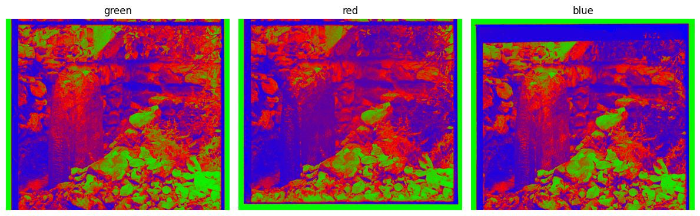
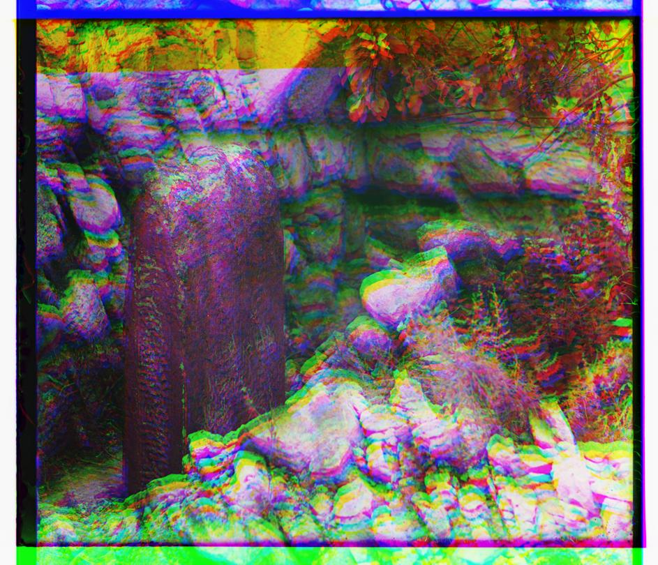
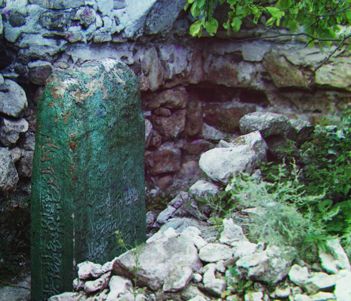
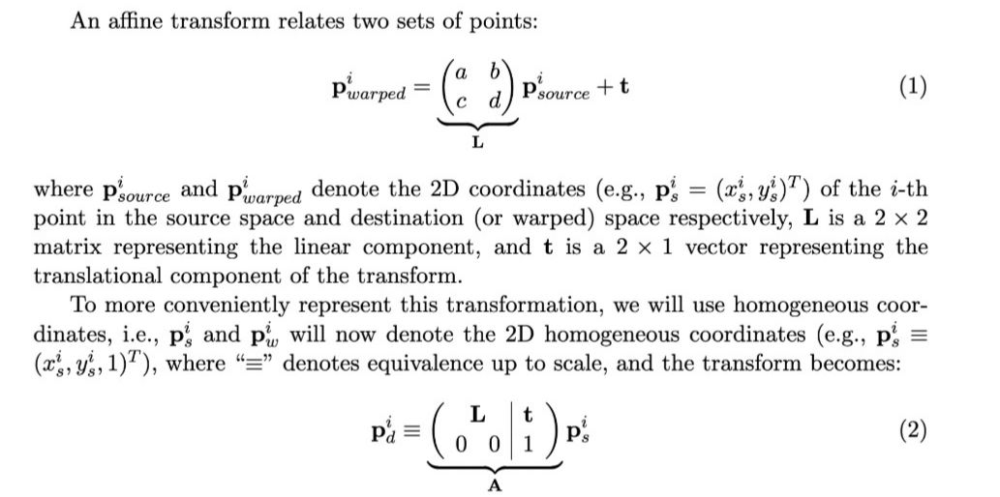
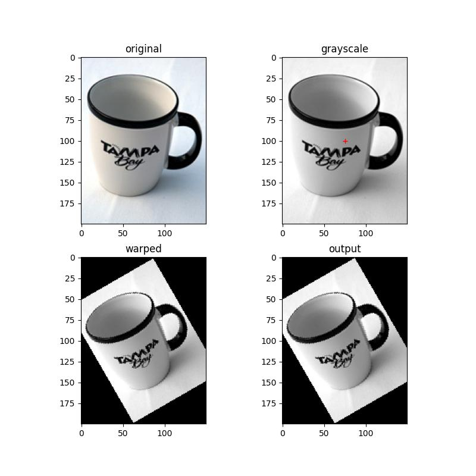

# Color Channel Alignment and Image Warping

To see it in action, git clone the repo and 
```bash
chmod +x run_*.sh
./run_all.sh
```
To do clean up
```bash
chmod +x clean.sh
./clean.sh
```

# Color Channel Alignment

Given a red, green, and blue channels of an image that were taken separately using an old technique that captured each color on a separate piece of glass, since these images were taken separately, just combining them in a 3-channel matrix may not work if you simply combine the images without shifting any of the channels. The easiest way to do align the color channels is to exhaustively search over a window of possible displacements for the different channels. Score the alignment from each possible displacement with some heuristic and choose the best alignment using these scores.

The individual channels are shown below



Combining the red, green, and blue channels without shifting



A better image can be achieved by using alignment, pyramids and cropping the edges



# Image Warping

Affine Transformation



Given image


Generating affine transformations of the given image


